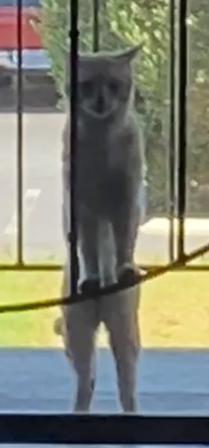
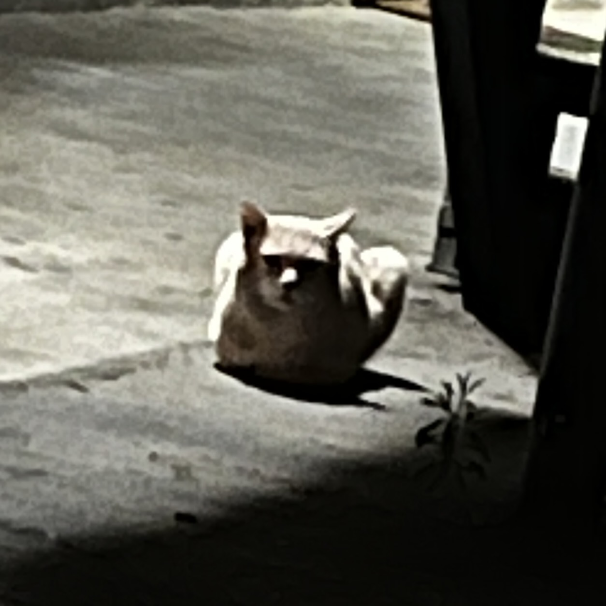

Hello, my name is Andres Hinojosa. I am a graduate student at CSUSM and will graduate in May 2026. My email is: hinoj030@csusm.edu

| | |
| --- | --- |
|  |  |

## 🌐 Socials:
 

## 📊 Stats:

## 🏆 GitHub Trophies

---

<!-- Proudly created with GPRM ( https://gprm.itsvg.in ) -->
